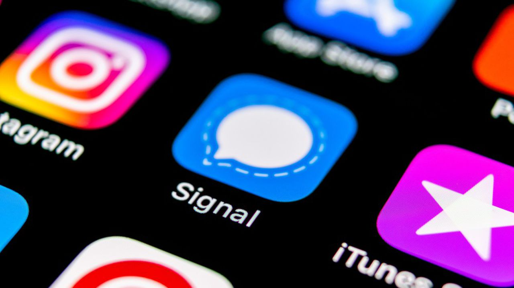

After the privacy related changes to WhatsApp, a lot of people are fleeing this popular chat application for other more privacy-aware choices. This development, made me consider Signal, again, as a chat service, but my decision to install it and try to move my contacts was **not a privacy related one**. 

In Greece where me and most of my contacts live, WhatsApp isn't as popular as Facebook's Messenger, an app that lacks end-to-end encryption and as a result is considerably worse privacy-wise. 

End-to-end encryption is a technical measure, implemented to make eavesdropping on your chat conversations impossible. It encrypts your messages from the moment they leave your device, till the moment they are received by your friend's phone. In this way, nobody can use your conversations to sell your information to advertisers and no rogue government can read your messages to enforce laws. But for the average person living in a western democracy, who still (knowingly or unknowningly) uses Facebook and other ad-supported, privacy-invasive social networks, this feature is not as important as it seems.

Messenger, for me, is the best chat app in the world, because it has the only feature I need from a chat app. **My contacts!** 

If I want to contact somebody, I know that he will be there receiving my messages. This feature is enough for me to give up the promise of enchanced privacy.

It's something different that should be more important.

## But why did I install Signal?

Although we feel that we can choose our chat service, the direct opposite happens. The best feature mainstream chat apps have, our contacts' usage of them, is the reason we are hostages to these applications. If we want to move to another chat application, we need to pursue all of our contacts to move. This is the great power Facebook is using irresponsibly. 

This power is what takes away from us the right to choose who and why is using our data. 

But more importantly, this power hinders innovation and progress. If a better chat application is released, then most people wouldn't care to use it. That happens because it wouldn't have the most important feature, their friends. Eventually, if this application is really better than the current offerings, the best features would be copied by the mainstream apps and the vicious cycle will continue.

Trying to go against this great power, I installed Signal. I chose Signal because it is in a way the direct opposite of what Facebook's apps are. It is open-source, people can view and contribute to its code and it's backed by a non-profit. It's an app that implements changes based to what its community wants, it's an app that can care about your opinion and your choices.

I immediately invited my closest contacts to join and... people joined, then agreed that this app is nice and afterwards nobody contacted me a second time through Signal. Everybody still used Messenger. 

At the end, I completely understood their choice, or better, their **lack of choice**. If they wanted to keep in touch with their other friends, they still needed to use Messenger, and who wants to complicate their lives with multiple apps?

## At the end, what can we do?

When the internet started proliferating, choice was one of its biggest advantages. We could choose the software we use, we could choose the services we access. But now, the massive social networks, with the power they have accumulated by our participation, have narrowed down our choices to the bare minimum.

The only way to change the situation is to force those social networks to use their powers more responsibly. Europe's GDPR law with its [right to data portability](https://www.privacypolicies.com/blog/gdpr-eight-user-rights/#6_The_Right_To_Data_Portability) is a step in the right direction, but it's not enough. I believe we need more to regain our right to choose what services we use. 

After portability, we need to discuss about **interoperability**, which in this case is the ability to contact people that are are using different chat applications than the one you are using. The way email and SMS already work. 

Although this is still far-fetched, we need to finally start addressing it.
## Further reads

* [What is ActivityPub?](https://www.jeremydormitzer.com/blog/what-is-activitypub.html)
* [Signal: What is it and why is everyone talking about it?](https://www.androidauthority.com/signal-app-1148147/)

## How do you feel about the right to choice?

I would love to discuss more about it in the comments. 